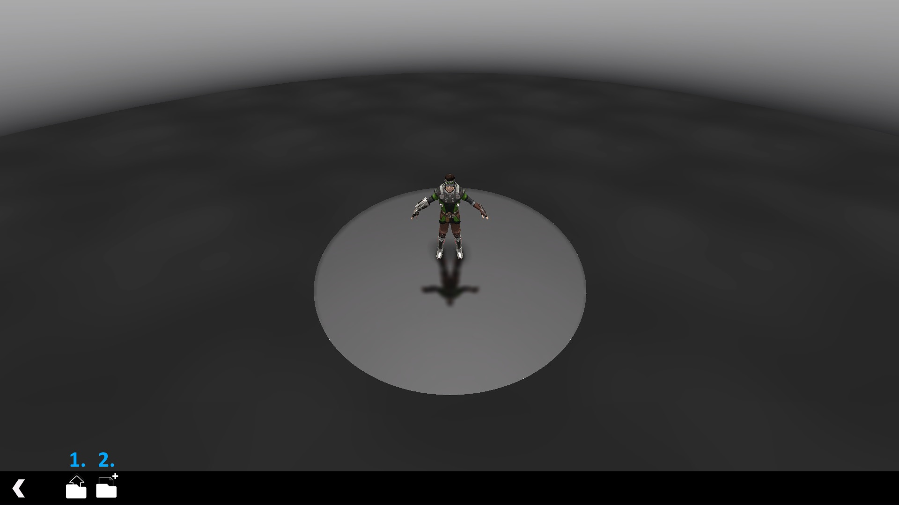
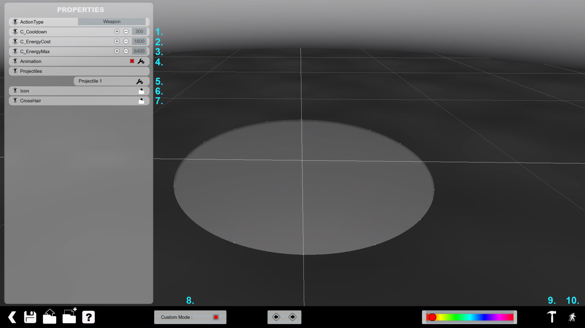
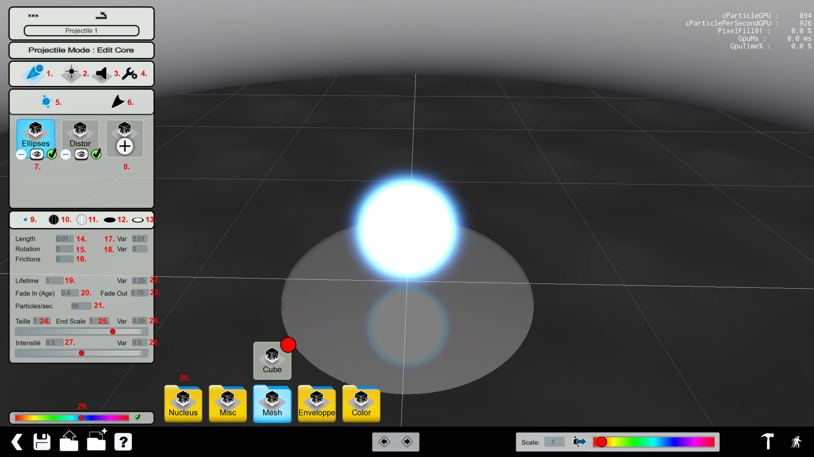
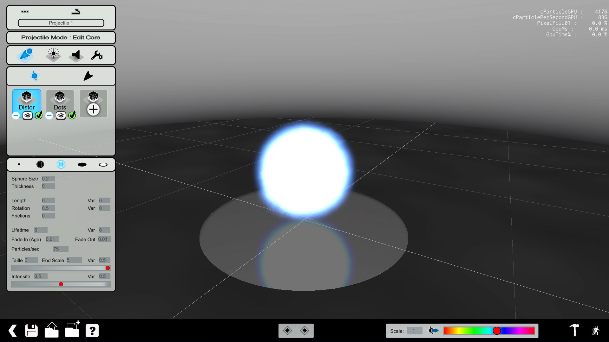
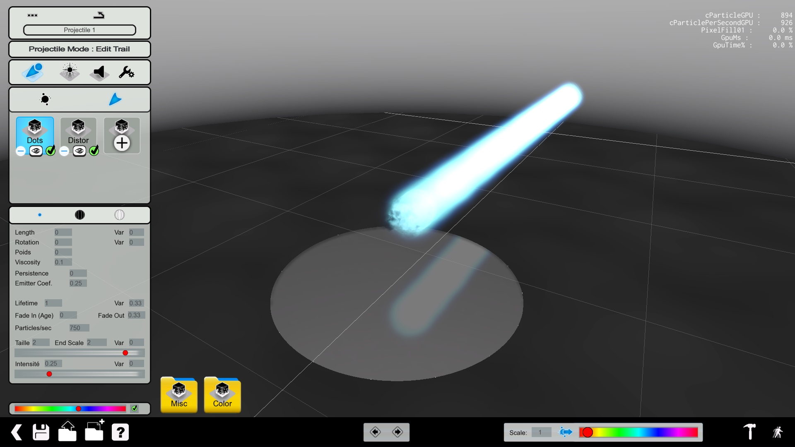
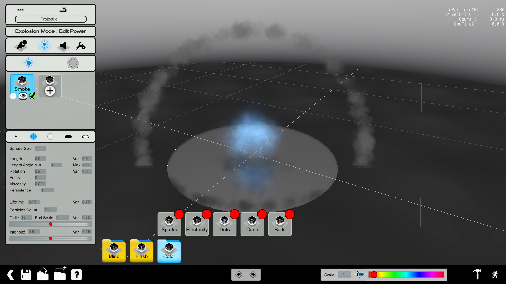
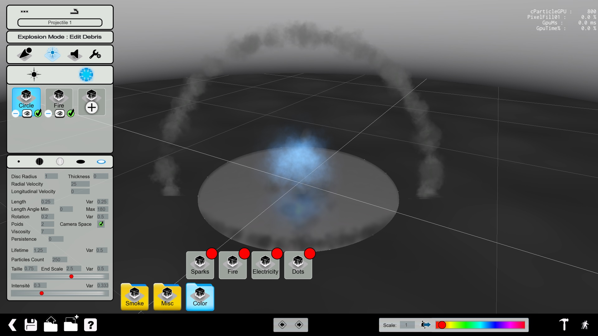
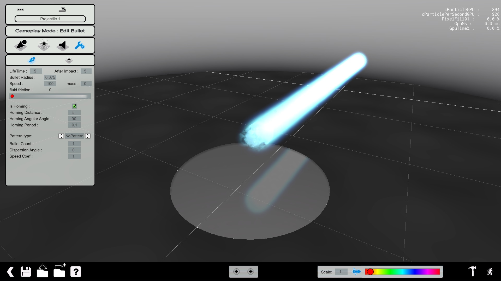
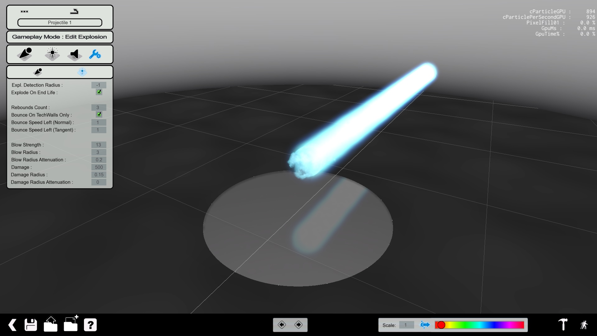

**Table of Contents**  *generated with [DocToc](http://doctoc.herokuapp.com/)*

- [The weapons](#the-weapons)
	- [Creating the basic settings of the weapon](#creating-the-basic-settings-of-the-weapon)
	- [Creating the core](#creating-the-core)
	- [Creating the tail](#creating-the-tail)
	- [Time to explode everything](#time-to-explode-everything)
		- [I've got the power](#ive-got-the-power)
		- [Attack on Debris](#attack-on-debris)
	- [Put da sound](#put-da-sound)
	- [Last part but not the least: the gameplay](#last-part-but-not-the-least-the-gameplay)
		- [The Bullet](#the-bullet)
		- [The Explosion](#the-explosion)
	- [Few tips on weapon creation](#few-tips-on-weapon-creation)

# The weapons
In the ActionMaker, you can create custom weapons. A weapon is a set of elements combining several visual effects, and an almost complete customization of the gameplay values and effects.

We'll learn how to create a weapon by making a sort of... kamehameha!

## Creating the basic settings of the weapon

First you have to create a new weapon by clicking in the second icon at the bottom of the screen and then you choose to create a `weapon`.

 1. Cooldown between each shot (in milliseconds, 1000ms = 1sec)
 2. The cost of one ammo (in unit)
 3. The maximum energy of the weapon (in unit)
 4. Create a custom animation while firing (it's facultative, not that if you create an animation for the weapon, you'll not be able to move until the animation is over. Moreover the animation can stop your character in the air if you activate the weapon while you're in the air) **DOESN'T WORK YET!**
 5. Customize the visual and gameplay parameters of the weapon
 6. Attribute an icon for the weapon (which will be displayed in the HUD, the file must be in DDS format)
 7. Attribute a custom crosshair for this weapon (in DDS format)
 8. Activate the Script mode where you can code directly the behaviour of the weapon. Can be needed if you want to give a specific behaviour for your weapon
 9. Allowing you to test the weapon with the map or the mode of your choice
 10. Test your map immediately in the default test map

Usually you will set the first three parameters and after that you'll start to customize your weapon.

## Creating the core

You'll have the interface for creating the core of the weapon, the initial visual design.

Let's first list all the options:

 1. Projectile Mode
 2. Explosion Mode
 3. Sound Mode
 4. Gameplay parameters
 5. Core settings
 6. Trail settings
 7. Effect applied on the core
 8. Add an effect on the core
 9. Point shape
 10. Full sphere shape
 11. Empty sphere shape
 12. Disc shape
 13. Circle shape
 14. Lenght of the visual effect (depending of the shape)
 15. Rotation of the effect
 16. Force of the friction of the bullet (if it's slow down more or less when touching the ground, if the bullet isn't exploding on the impact)
 17. Variance of the length of the visual effect
 18. Variance of the length of the rotation
 19. Lifetime of the visual effect (before restarting the visual effect (like a pulse))
 20. Speed of the fade in of the effect
 21. Number of particules for the effect. More particules there is, more the effect will be detailed but the weapon will be heavier for the computer to display (can be incapaciting if several players use the weapon during a game)
 22. Variance of the lifetime of the effect
 23. Speed of the fade out of the effect
 24. Size of the effect at the beginning of the shot
 25. Size of the effect at the end of the effect
 26. Variance of the size of the effect
 27. Intensity of the effect (can be almost transparent)
 28. Variance of the intensity
 29. Apply a colour for this effect only
 30. Style of the effect

So to create a Kamehameha with the ActionMaker, we have first to create its core, the "heart" of the effect.

> **Note:** The options 14., 15. ,17. and 18. may change according to the shape used (mostly for the disc/circle shape for equivalent fields).
> **Note:** We assume that the fields have a value of 0, that way i name only the fields which are modified.

First create the core with the `Dots` effect with the current settings:

- Shape: Point
- Lifetime: 5
- Particules/sec: 10 (which is enough to have a steady glowing sphere)
- Size: 2 (to be almost as big as the player, like in DBZ)
- End size: 3
- Intensity: 1 (to have this energy ball look-a-like)
- Intensity variance: 0.25 (to not have a too booring effect, to have a "living" effect)

Then we add a `Distor` effect to give a more living effect to the bullet when it'll be fired with the following parameters:

- Shape: Empty Sphere
- Sphere size: 0.2
- Rotation: 0.5
- Lifetime: 5
- Particules: 75
- Size: 3
- End scale: 5
- Size variance: 0.5
- Intensity: 0.5
- Intensity variance: 0.5

With those settings now we really have the impression to have an DBZ-like energy ball.

Those settings allow us to have a core quite stable in term of looking for the purpose we have.

## Creating the tail
The creation of tail of the weapon is almost the same than the core except few different options:

- Weight (to have a pending trail (up or down))
- Persistance: It's how long the particule will be dragged from its starting point
- Emitter Coef:

And now the parameters for a Kamehameha tail style with a `Dots` effect!

- Shape: Point
- Length: 0.01
- Lifetime: 5
- Fade Out: 0.01
- Particules/sec: 750
- Size: 3
- End Scale: 2
- Size Variance: 0.95
- Intensity: 1
- Intensity variance: 0.25

Now you can see the result of the projectile by loading the test map by cliking on the bottom-right of the screen or simply the travel icon between the global colorization tool and the global scale parameter at the bottom on screen.

## Time to explode everything
Now that our projectile is ready, it's time to customize the style of the explosion. We'll create first its power.

The power is the visual effect of the impact of the projectile on a player or any solid object in the world.

### I've got the power
As usual, most of the parameters are identical like the previous ones, with very few changes:

- Length: diameter of the effect
- Length Angle Min/Max: Minimum/Maximum angle of the effect (for example an angle of 10 will looks like a shotgun/flamethrower gun)
- Viscosity: Will compact the particules (to have a more concentred effect)

It's time to setup the power of the explosion:

- Effect: Misc/Embers
- Shape: Disc
- Disc Radius: 1
- Height: 0.1
- Length: 30
- Length variance: 1
- Length Angle Min/Max: 0/90
- Viscosity: 5
- Persistance: 0.5
- Lifetime: 1
- Lifetime variance: 0.66
- Particules/sec: 50
- Size: 2
- End Scale: 1
- Size Variance: 0.75
- Intensity: 1
- Intensity variance: 0.25

The result is a okay-ish explosion power style.

### Attack on Debris
We can create also an effect, the debris, which is like the ground blast of a nuclear weapon. Personnaly i choose a medium disc blast effect like... nuclear weapons!

- Effect: Smoke/Circle
- Shape: Circle
- Radial Velocity: 7 (Speed from the starting to the ending point)
- Length: 1
- Length variance: 0.25
- Length Angle Min/Max: 0/180
- Rotation: 0.2
- Rotation variance: 0.5
- Weight: 2
- Viscosity: 7
- Lifetime: 1.25
- Lifetime variance: 0.5
- Particules/sec: 100
- Size: 0.5
- End scale: 3
- Size variance: 0.5
- Intensity: 0.3
- Intensity variance: 0.333

## Put da sound
This part is quite simple, you have to choose a sound for each sequence:

- When the player fire the projectile
- The sound of the projectile itself
- The sound when the projectile explodes

For the moment you're limited to the sound listed in the library.

## Last part but not the least: the gameplay
Of course this is one of the most important part of your projectile, maybe the most, the gameplay mechanics of your weapon.

This tab is separated by two tabs: Bullet and Explosion.

### The Bullet
The first one indicates the gameplay behaviour of the bullet and the other the explosion itself.

Let's see the options for the bullet:

- Lifetime: this is the duration of the bullet (so the visual effect must be lower or equal to this value)
- Duration of the presence of the bullet after the impact
- Radius of the bullet (a radius too high can prevent you to fire correctly (it'll explode when fired), a Radius set at 1 is a correct setting if you planned to fire with the weapon straight front of you)
- Speed: Travel speed of the bullet (for a hitscan-esque weapon, put it > 400)
- Mass: Weight of the bullet (so it'll go up or down depending of the mass)
- Fluid friction: the bullet will slow down (more or less quicker/stronger) as we go along to the distance traveled by the bullet
- Show Player Explosion: Display the hit particules on the shield of the players when hit (useful to deactivate them for minigun-like weapons).
- Is Homing: Activate the bullet in "guided-missile" mode. It'll follow the closest player (visible (like behind a wall) or not).

And there is several movement patterns if you don't want to have a straight forward bullet only with each its parameters.

The few parameters where you need explanations are:

- Speed Coef: You decide if the projectile core visual effect is ahead the bullet effect (gameplay-speaking)
- Blend duration:
- Apex regroup:
- Min Apex Time:
- Random Rotations:

For our weapon, we'll enter the following values:

- Pattern type: NoPattern
- Bullet Count: 1
- Dispersion Angle: 0
- Speed Coef: 1

### The Explosion
Now that you've setup the bullet, you have to configure the explosion.

- Explosion Detection Radius: The default parameter indicate that the explosion will occur when the bullet will hit something. If you can change this parameter, a bullet can explode in a radius or 5 meters for example around the bullet (a little like how the Nucleus works)
- Explode On End Life: The projectile will explode (or not) when its lifetime is reached (which was set in the previous tab)
- Rebounds Count: The numbers of maximum rebounds for the projectile
- Bounce On Tech Walls Only: if checked, the projectile will bounce only on Tech blocks (the red ones), else it'll bounce on any plateform.
- Bounce Speed Left (Normal/Tangent): Change the speed of the projectile when it bounces on a surface.
- Blow Strength: This is the strength of the bump when a projectile explodes near a player.
- Blow Radius: This is the radius of the blow
- Blow Radius Attenuation: Decrease more or less (or none) the strength of the blow related to the distance.
- Damage: Amount of damage inflicted to a player
- Damage Radius: This is the radius where the damage are given from the explosion location
- Damage Radius Attenuation: Decrease the damage given related to the distance between the explosion and a player. It must be equal or lower to the Damage Radius parameter.

And now the settings for our weapon:

- Explosion DR: -1
- Explodes on EL: Yes
- Rebounds Count: 3
- Bounce on TechWalls Only: Yes
- Bounce Speed Left (Normal/Tangent): 1
- Blow Strength: 9001 (Because it's over 9000)
- Blow Radius: 15
- Blow RA: 0
- Damage: 9001 (Because it's over 9000)
- Damage Radius: 15
- Damage Radius Attenuation: 0

Now you have a fully usable kamehameha (but a lot overpowered ^^)!

## Few tips on weapon creation

- Avoid to have a too high number of particules, if you do it, when several players will play, there is a high risk that they will suffer of performance issue cause of the high amount of particules. For example the Storm rocket use around 10 000 particules by bullet. So keep it as low as to maintain good performance for all the players.
