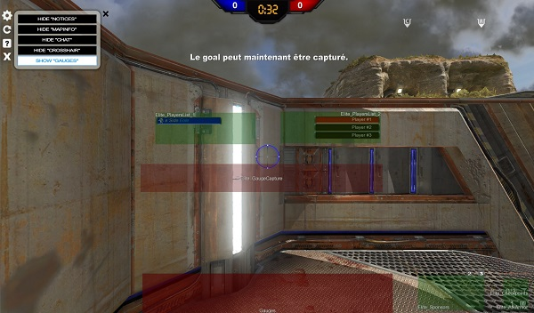

# Purpose
This library is designed to allow players to customize their UI. There's two levels of customization :
  * The UI created by the mode
  * The default UI of the game
On one hand the mode creators can use the library to add customizable modules in the Manialinks. These modules can then be moved or hidden by the players.
On the other hand the default UI of the game can only be hidden but not moved. By example this include the gauges at the bottom of the screen or the crosshair in ShootMania.
Every change made on the UI is saved in the player's profile. So each time he will play the mode he'll have his custom settings.
To open the customization window the user must pressed the "F8" key.

# Usage
To use this library add this line at the beginning of your script :
`#Include "Libs/Nadeo/CustomUI.Script.txt" as CustomUI`

As most of the other libraries there are a Load() and Unload() functions. They are best called respectively in the `***StartServer***` and `***EndServer***` labels.

If you start your mode now and press the F8 key, you will open the customization menu. But you'll only be able to customize the default UI of the game. You have to manually add all your custom modules with the `Add()` function to see them. It takes several parameters :

  - (Text) The name of the module. This name must be unique to avoid that another script erase/overwrite your module configuration. A good practice would be to prefix your module name with the name of your mode. eg : MyModeName_MyModuleName.
  - (Vec2) The default position of the module.
  - (Vec2) The size of the module.
  - (Text) The vertical alignment of the module. Can be "top", "center" or "bottom". Any other value will be converted to "center".
  - (Text) The horizontal alignment of the module. Can be "left", "right" or "center". Any other value will be converted to "center".
  - (Boolean) Is the module movable or not.
  - (Boolean) Is the module hidable or not.
  
This function has two overloaded versions. One without the movable/hidable parameters and one without the alignment and movable/hidable parameters.

Once you created the modules you can call the `Build()` function that add all of them in the customization menu Manialink. This modules are just a visual representation (a colored rectangle) that will allow the player to move or hide the Manialink frames that are enslaved to them. 

Now lets see how to associate a module with a frame in your custom Manialink :
 
<frame class="LibCustomUI_Module" id="MyModeName_Example">
  <label text="Im customizable!" scale="3" />
</frame>

All you have to do is wrap your customizable content in a frame with the "LibCustomUI_Module" class and the name of your module as id. In this example it's just a label, but it can be any part of your Manialink. All the content of the frame will be movable/hidable by the players. After that you have two possibilities to add the necessary script to your Manialink : 
  * it doesn't have a script, then you can call the `InjectMLFullScript()` function,
  * it already have a script, so you have to use the `InjectMLInit()` and `InjectMLLoop()` functions.
Example without a script :
 
MyLayer.ManialinkPage = """
<frame class="LibCustomUI_Module" id="MyModeName_Example">
  <label text="Im customizable!" scale="3" />
</frame>
{{{InjectMLFullScript()}}}
""";
.
Example with a script :
 
<frame class="LibCustomUI_Module" id="MyModeName_Example">
  <label text="Im customizable!" scale="3" />
</frame>



With that done, if you restart your script you should be able to customize your modules by pressing F8.

The library also contains some utility functions :

* `Remove()` removes a module from the customization menu and take one parameter :
  * (Text) The name of the module to remove.
You have to call the `Build()` function after to take the change into account.

* `Exists()` checks if there's already a module with a given name loaded in the customization menu. It take one parameter :
  * (Text) The name of the module to check.

* `Attach()` adds the CustomUI library layer to UIAll.
* `Detach()` removes the CustomUI library layer from UIAll.

* `SetMenuKey()` modify the key to press to open the customization menu. It takes one parameter :
  * (Text) the name of the key to press.
You have to call the `Build()` function after to take the change into account.