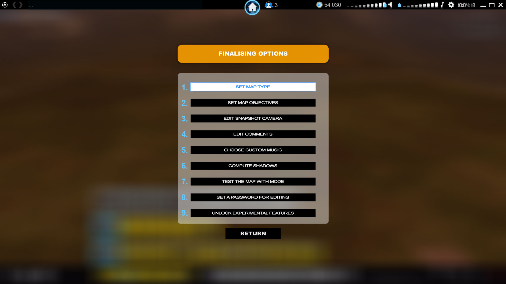

# Introduction to the Map Editor
The map editor is a tool allowing you to create very easily a map with the "block" system existing since TrackMania Original. In the Map Editor you have an integrated [MediaTracker](../mediatracker/) to be able to create opening/podium/ingame sequences bounded to the map.

# Explanation of the UI
The UI of the Map Editor is quite simple, first, we'll explain you the interface:

1. Save the map
2. Show the helpers
3. Terraformation Mode: To be able to create hills & mountains on the field
4. Block mode: This is the place where you find all the blocks: Start/Finish blocks, bumpers, roads, decorations, poles, checkpoints, etc.
5. Skinning mode: this mode is used when you need to skin dedicated blocks like panels (because they can displayed an image located on the web)
6. Item mode: This place can be important for Title Pack owners, this is where you will find all the custom objects. This is also where you'll find the bots (the bots are considered as Items in the Editor)
7. Macroblock mode: A macroblock is a group of blocks that can be save together and be used later in an other(s) map(s)
8. Erase tool: simple tool to delete blocks/items
9. Undo: Cancel your last(s) action(s)
10. Redo: Redo your cancel(s) action(s)
11. Picker tool: allows you to transform the cursor into the block where the cursor is on.
12. Copy/Paste: Copy/Paste an area of the map
13. Freelook tool: allows you to navigate in the map instead to add blocks on the map
14. Underground mode: This mode is used when you want to add underground blocks on the map
15. Edit Offzone: Use it when you want to delimit an area where the player will be eliminated when he'll touch it.
16. Plugins mode: This is where you can activate/deactivate plugins for the map editor
17. Advanced Customziation Tools: This is the place where you have access to the most advanced tools of the map editor.

    1. Set Maptype: Define for which mode the map is intended for (so it'll tell you what must be present in the map to be compatible with the mode).
    2. Set Map objectives: You may have to specify manually the objectives (like the spawns/poles/checkpoints) to have the map compatible with the mode.
    3. Edit Snapshot Camera: To specify the thumbnail to use to illustrate the map in the menus
    4. Edit comments: It's if you want to leave a comment about the map
    5. Choose custom music: if you want to bound a music with the map (which weigh down the size of the file)
    6. Compute Shadow: calculate to create the shadows on the map (mandatory if you want to play the map)
    7. Test map with mode: If you want to test the map directly with a specific gamemode
    8. Set a password for editing: if you want to password-protect your map (can't be opened in the editor without the password)
    9. Unlock experimental features: This is where you find the options like activate the mixmapping (i'll explain a bit later) and the air-mapping (the ability to create use block in the air instead to have them on the ground)
18. Use the embedded MediaTracker. With it you create an Intro, an Ending, a ingame sequence, a custom podium sequence and an ambiance for your map.
19. Click on this button to test directly the map as a player
20. Validate the map: When the flag is red, it means that the map isn't usable with the selected gamemode. If it's orange, it means that you have to play it at least once to validate it (through the map editor). If it's green, it means that the map is validate for the gamemode.
21. Indicates the maptype associated to the map
22. Block properties: Set/Modify the properties of a block (usually works for spawns, poles, checkpoints)
23. Name of the map
24. Author of the map
25. Weight of the map (in Planets, **Note that your Planets aren't used when you create a map, it's just an indication**)
26. State of the map

> NB: To navigate in the map, it's quicker to do ALT+cursor instead of switching mode each time you need to move the camera

> NB:
